<h1>Generative AI Project Template</h1>


[](https://www.python.org/downloads/release/python-3110/)
[](https://www.debian.org/)
[](#)

[](#)
[](https://pytorch.org/get-started/locally/)
[](#)

[](#)
[](#)

[](https://github.com/charliermarsh/ruff)
[](#)
[]()
[](#)
[](#)
[](#)

Template for a new AI Cloud project.

Click on [<kbd>Use this template</kbd>](https://github.com/aminedjeghri/ai-cloud-project-template/generate) to start your own project!


This project is a generative ai template. It contains the following features: LLMs, information extraction, chat, rag & evaluation.
It uses LLMs(local or cloud),streamlit (with and without fastapi) & Promptfoo as an evaluation and redteam framework for your AI system.

| Test embeddings                                       | Test chat                                            |
|-------------------------------------------------------|------------------------------------------------------|
|  |  |

**Engineering tools:**

- [x] Use UV to manage packages
- [x] pre-commit hooks: use ``ruff`` to ensure the code quality & ``detect-secrets`` to scan the secrets in the code.
- [x] Logging using loguru (with colors)
- [x] Pytest for unit tests
- [x] Dockerized project (Dockerfile & docker-compose).
- [x] Streamlit (frontend) & FastAPI (backend)
- [x] Make commands to handle everything for you: install, run, test

**AI tools:**

- [x] LLM running locally with Ollama or  in the cloud with any LLM provider (LiteLLM)
- [x] Information extraction and Question answering from documents
- [x] Chat to test the AI system
- [x] Efficient async code using asyncio.
- [x] AI Evaluation framework: using Promptfoo, Ragas & more...

**CI/CD & Maintenance tools:**

- [x] CI/CD pipelines: ``.github/workflows`` for GitHub (Testing the AI system, local models with Ollama and the dockerized app)
- [x] Local CI/CD pipelines: GitHub Actions using ``github act``
- [x] GitHub Actions for deploying to GitHub Pages with mkdocs gh-deploy
- [x] Dependabot ``.github/dependabot.yml`` for automatic dependency and security updates

**Documentation tools:**

- [x] Wiki creation and setup of documentation website using Mkdocs
- [x] GitHub Pages deployment using mkdocs gh-deploy plugin


Upcoming features:
- [ ] add RAG again
- [ ] optimize caching in CI/CD
- [ ] [Pull requests templates](https://docs.github.com/en/communities/using-templates-to-encourage-useful-issues-and-pull-requests/creating-a-pull-request-template-for-your-repository)
- [ ] Additional MLOps templates: https://github.com/fmind/mlops-python-package
- [ ] Add MLFlow
- [ ] add Langfuse


## 1. Getting started
This project contains two parts:

- The AI app: contains an AI system (local or cloud), a frontend (streamlit), with an optional backend(fastapi).
- (optional)The Evaluation Tool: The evaluation tool is used to evaluate the performance and safety of the AI system. It uses promptfoo & RAGAS, Python 3.11 and NVM are needed, but no need to install them by yourself since the project will handle that for you.

The following files are used in the contribution pipeline:

- ``.env.example``: example of the .env file.
- ``.env`` : contains the environment variables used by the app.
- ``Makefile``: contains the commands to run the app locally.
- ``Dockerfile``: the dockerfile used to build the project inside a container. It uses the Makefile commands to run the app.
- ``.pre-commit-config.yaml``: pre-commit hooks configuration file
- ``pyproject.toml``: contains the pytest, ruff & other configurations.
- ``src/api/log_config.py`` and ``src/main_backend.py``: uvicorn (fastapi) logging configuration.
- ``src/utils.py``: logger (using logguru) and settings using pydantic.
  the frontend.
- `.github/workflows/**.yml`: GitHub actions configuration files.
- `.gitlab-ci.yml`: Gitlab CI configuration files.
- ``.gitignore``: contains the files to ignore in the project.

Tree:

```

├── .env.example # example of the .env file
├── .env # contains the environment variables
├── Dockerfile # the dockerfile used to build the project inside a container. It uses the Makefile commands to run the app.
├── docker-compose.yml # docker-compose configuration file (used to run the frontend and backend in docker)
├── Makefile # contains the commands to run the app (like running the frontend, tests, installing packages, docker...)
├── assets
├── pyproject.toml # uv, dependencies, pytest, ruff & other configurations for the package
├── uv.lock # uv lock file
├── .pre-commit-config.yaml # pre-commit hooks configuration file
├── .gitignore # contains the files to ignore in the project
├── .github
│   ├── dependabot.yml # dependabot configuration file
│   └── workflows # GitHub actions configuration files
│       └── test-deploy.yaml
├── mkdocs.yml # mkdocs configuration file
├── scripts
│   └── gen_doc_stubs.py # mkdocs : generate documentation stubs
├── src
│   ├── api
│   ├── evaluation
│   ├── main_backend.py
│   ├── main_frontend.py
│   ├── ml
│   ├── settings.py
│   └── utils.py # logger (using logguru) and settings using pydantic.
├── CODE_OF_CONDUCT.md
├── CONTRIBUTING.md
├── README.md
├── LICENSE
└── tests
```


### 1.1. Local Prerequisites

- Ubuntu 22.04 or MacOS
- git clone the repository
- UV & Python 3.11 (will be installed by the Makefile)
- Create a ``.env`` file *(take a look at the ``.env.example`` file)*


### 1.2 ⚙️ Steps for Installation (Users)
#### App (AI, FastAPI, Streamlit)
You can run the app in a docker container or locally.
#### Docker:
- The `docker-compose.yml` file is used to run the app in a docker container. It will install the following services: frontend, backend and ollama. Your can comment out ollama if you don't need it.
- The `docker-compose.yml` will use the `.env.example.docker` file to configure the environment variables. Per default, it uses ollama docker container.
- Run this command : `make docker-compose` then go to [http://localhost:8501](http://localhost:8501)

#### Local :
1. To install the app, run `make install-prod`.
2. Choose one of the following options:
   - **Local model**: we use Ollama and litellm to run local models. The default model is `qwen2.5:0.5b` which is a very lightweight model but can be changed.
     - Create a ``.env`` file *(You can copy and paste the ``.env.example`` file with `cp .env.example .env`)*
     - Install Ollama (for openai) `make install-ollama`
     - Download the model, run `make download-ollama-model`. It will download the model present in the `OLLAMA_MODEL_NAME` var in the ``.env`` file (default is `qwen2.5:0.5b`).
     - Run ollama to emulate openai : `make run-ollama`
     - Run `make test-ollama`. You should see an output with a response.
     - Discuss with the model : `make chat-ollama`
   - **Cloud model:**
     - Create/update the ``.env`` file *(You can copy and paste the ``.env.example`` file with `cp .env.example .env`)*
     - Follow the litellm [naming convention](https://docs.litellm.ai/docs/providers).

3. Run `make test-inference-llm` to check if your LLM responds.
4. Run the app:
- To run the app with Streamlit (and without fastapi), run `make run-frontend`
- To run the app with both Streamlit and FastAPI, run `make run-app`

### 1.3 ⚙️ Steps for Installation (Contributors and maintainers)
Check the [CONTRIBUTING.md](CONTRIBUTING.md) file for more information.

## 2. Contributing
Check the [CONTRIBUTING.md](CONTRIBUTING.md) file for more information.
